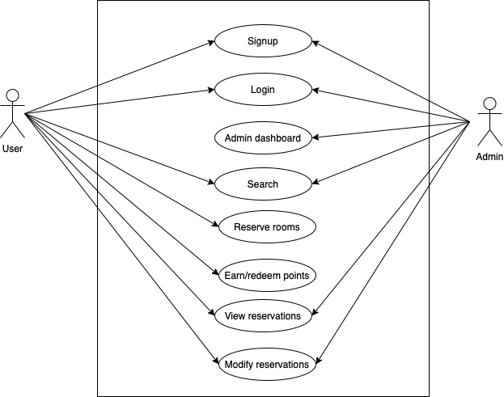
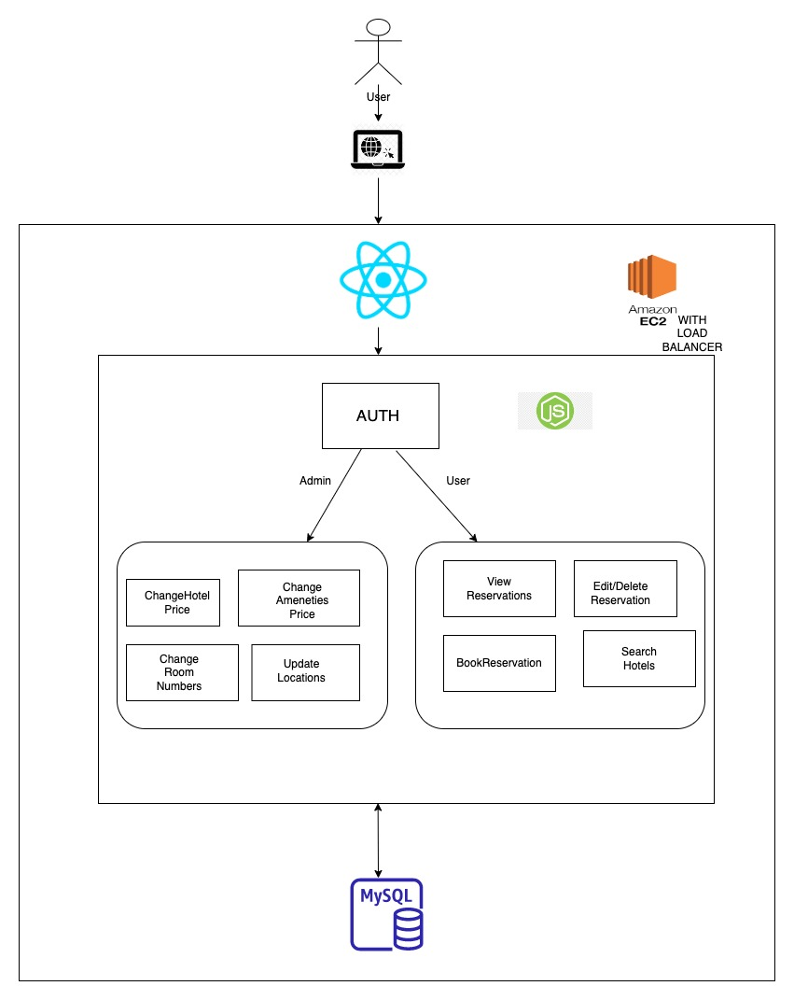
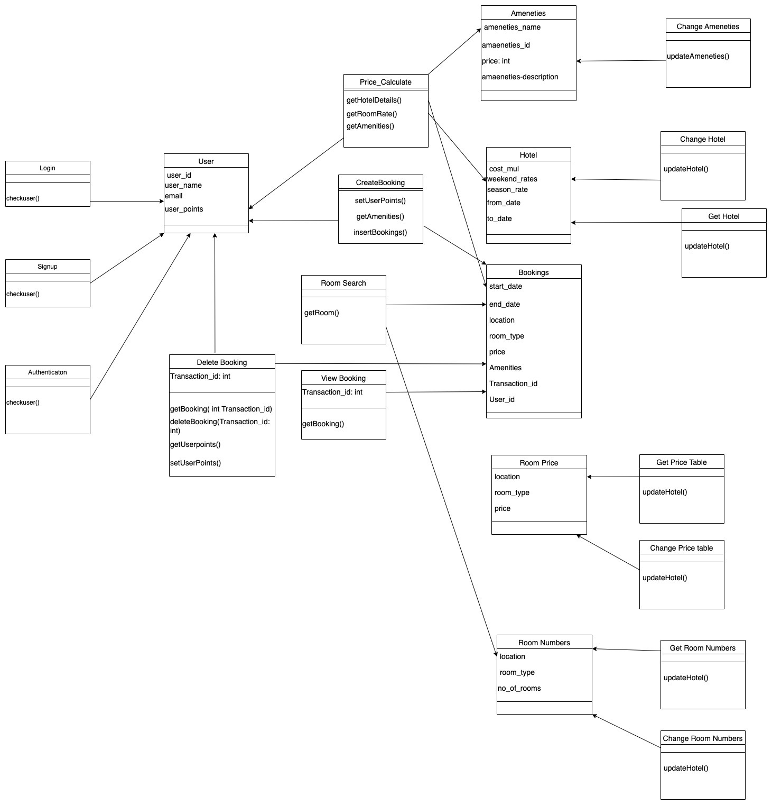
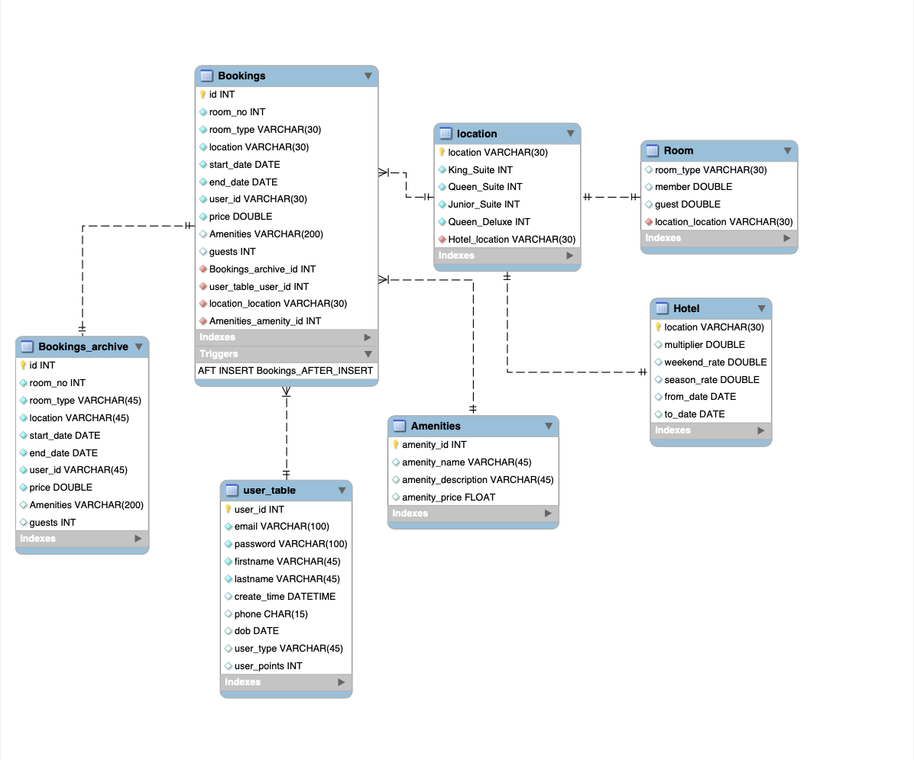
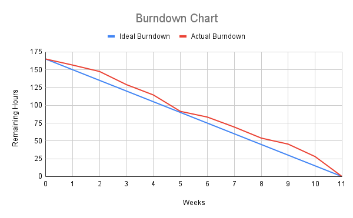

# team-project-the-avengers
## Team Members
1. Adarsh Samuel Raj Johnson
2. Amy Phan
3. Faizali Mulla
4. Visva Suthar

## Individual Contribution
1. Adarsh: Backend(User side: price_calculate, search room, create Booking, Delete Booking, view Booking; Admin side: All), Deployment on AWS with Load balancer
2. Amy: Frontend(all the pages) and Backend(edit reservations functionality)
3. Faizali:
4. Visva: Database and Backend for login and signup(includes authentication, password hashing and salting). Stored procedure and an event for Bookings archive to view past reservations.

## XP Core Values Followed
### Simplicity
Our team followed the simplicity aspect of the 5 XP core values. While coding the backend and frontend, we tried to make the code as simple as possible so that if a problem arises in the future, we would know where it is coming from. We avoided writing complicated code that we would not be able to understand if we do come back to it.

## Diagrams
### Use Case Diagram


### Architecture Diagram


### Class Diagram


### Database Diagram


## Feature Set
Users are able to:
- Enroll as a new customer
- Manage rewards points
- View all current/past reservations
- Search for hotels
- Book a room for stay up to 1 week
- Edit reservations
- Cancel reservations

Admins are able to:
- Add a new location
- Edit a location information
- Delete a location
- Edit number of rooms for each location
- Edit prices for each type of rooms
- Edit amenities prices
- Set weekend rates
- Set festive period and their corresponding rates

## Burndown Chart


## Requirements
- Node

## Steps to run locally
1. Navigate to web_ui directory:
```
cd Source/web_ui
```

2. Install dependencies:
```
npm install
```

3. Build frontend:
```
npm run-script build
```

4. Navigate to io_server directory:
```
cd Source/io_server
```

5. Install dependencies:
```
npm install
```

6. Start server:
```
npm start
```

7. Open the application on a web browser: http://localhost:3000/
